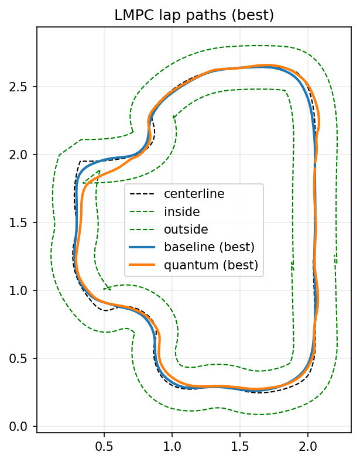
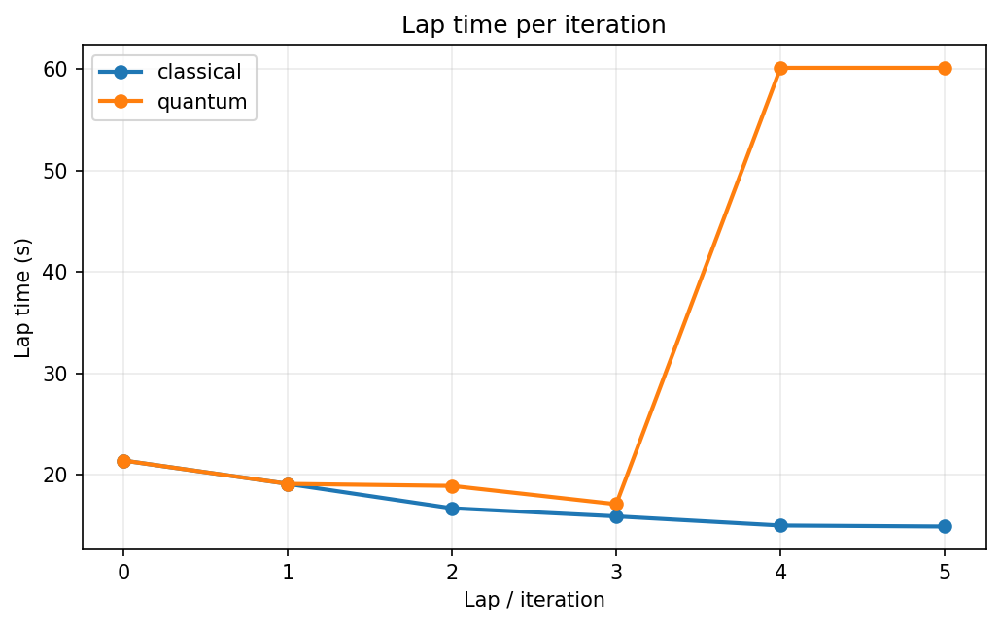

# Quantum LMPC (Duckietown)


Learning Model Predictive Control (LMPC) on the Duckietown `ETH_large_loop`, with an experimental **quantum-inspired augmentation** step based on **Grover amplitude amplification**.

This repo compares:
- **Classical LMPC**: terminal constraint/cost built from a safe set of previous laps using nearest-neighbor sampling.
- **Quantum-augmented LMPC**: proposes extra safe-set points by sampling short discrete control sequences with Grover search, biased toward trajectories that *advance further along the lap* while staying feasible.

## Results (example run)

Lap paths (best lap):



Lap time per iteration:



## What is “Quantum LMPC” here?

LMPC iterates laps. After each lap it stores visited states in a **safe set** and assigns a “steps-to-go” **cost-to-go** `J` (smaller `J` means closer to completing the lap). At runtime, the LMPC problem uses:
- a **terminal constraint** that forces the predicted terminal state to lie in the convex hull of a few safe-set points;
- a **terminal cost** that is a convex combination of the stored `J` values of those points.

The “quantum” part in this repo does **not** replace the LMPC optimizer. Instead, it augments the safe set:
- pick a set of start states along the last lap;
- enumerate all discrete control sequences over a short horizon `H` (here: 4 actions per step, so `4^H` sequences);
- score each sequence by how much it “advances” along the lap when snapped to the nearest safe-set state;
- build a phase oracle that marks “good” sequences (below a threshold) and run **Grover** to bias sampling toward them;
- roll out the sampled sequences and add the feasible/improving terminal states to the safe set for the next LMPC iteration.

Implementation entry points:
- Quantum safe-set augmentation: `duckrace/quantum/lmpc_augment.py`
- Grover sampler (statevector or IBM Runtime): `duckrace/quantum/sampler.py`
- Baseline vs quantum comparison runner: `duckrace/lmpc/duckietown_compare.py`

## Quickstart (local)

Prereqs:
- Python 3.9+
- A working X display (or use `xvfb-run` for headless)

Install:
```bash
python3 -m venv .venv
source .venv/bin/activate
pip install -r requirements.txt
```

Run baseline LMPC:
```bash
xvfb-run -a -s "-screen 0 1280x720x24" \
  python3 -m duckrace.lmpc.duckietown_compare --iterations 10
```

Run quantum-augmented LMPC (statevector simulator) and write plots:
```bash
xvfb-run -a -s "-screen 0 1280x720x24" \
  python3 -m duckrace.lmpc.duckietown_compare \
  --iterations 10 --quantum --plot --plot-out assets/lmpc_compare.png
```
This also writes `assets/lmpc_compare_lap_times.png`.

Disable augmentation (still runs the quantum pipeline, but keeps LMPC behavior unchanged):
```bash
xvfb-run -a -s "-screen 0 1280x720x24" \
  python3 -m duckrace.lmpc.duckietown_compare --iterations 10 --quantum --no-augment
```

## Docker (recommended for headless runs)

Build:
```bash
docker build -t quantum-lmpc .
```

Run and collect outputs:
```bash
mkdir -p outputs
docker run --rm -v "$PWD/outputs:/outputs" quantum-lmpc
```
The container writes plots and `run.log` into `./outputs/`.

## IBM Runtime backend (optional)

To sample Grover circuits on IBM Quantum hardware, use:
```bash
python3 -m duckrace.lmpc.duckietown_compare --quantum --ibm
```

Account configuration is handled by Qiskit; see `connection_test.ipynb` and `.env.example` for suggested environment variables.

## Notes

- The “quantum” component is a small, research-style prototype (short horizons, discrete actions). It’s meant as a *drop-in augmentation idea*, not a full quantum replacement for MPC.
- CasADi LMPC solvers are stored as `.casadi` files; if you change `K`, `i_j`, or `N`, the runner can generate a matching LMPC function via `scripts/generate_lmpc.py`.

## Tests

```bash
pytest -q
```
